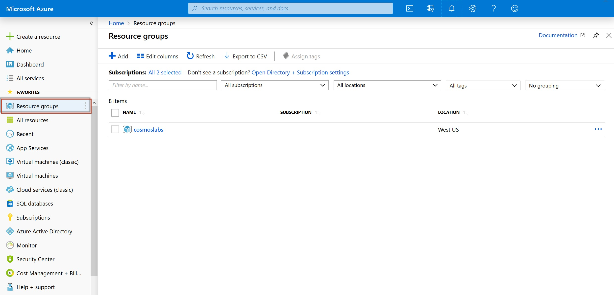

# Load Data Into Cosmos DB with ADF

In this lab, you will populate an Azure Cosmos DB container from an existing set of data using tools built in to Azure. After importing, you will use the Azure portal to view your imported data.

> If you have not already completed setup for the lab content see the instructions for [Account Setup](00-account_setup.md) before starting this lab.  This will create an Azure Cosmos DB database and container that you will use throughout the lab. You will also use an **Azure Databricks** resource to import existing data into your container.

## Create Azure Cosmos DB Keyspace and Table

You will now create a database and container within your Azure Cosmos DB account.

1. Navigate to the [Azure Portal](https://portal.azure.com)

2. On the left side of the portal, select the **Resource groups** link.

    

3. In the **Resource groups** blade, locate and select the **cosmoslabs** resource group.

    

4. In the **cosmoslabs** blade, select the **Azure Cosmos DB** account you recently created.

    

5. In the **Azure Cosmos DB** blade, locate and select the **Overview** link on the left side of the blade. At the top select the **Add Table** button.

6. In the **Add Table** popup, perform the following actions:

    1. In the **Keyspace name** field, select the **Create new** option and enter the value **nutritionkeyspace**.

    2. Do not check the **Provision keyspace throughput** option.

        > Provisioning throughput for a database allows you to share the throughput among all the containers that belong to that database. Within an Azure Cosmos DB database, you can have a set of containers which shares the throughput as well as containers, which have dedicated throughput.

    3. In the **Table Id** field, enter the value **foodtable**.

    4. In the **schema** field, enter:

    ```json
    (foodid text, commonName text, isFromSurvey text, manufacturerName text, nutrients text, servings text, description text, tags text, foodGroup text, version text, primary key(foodid))
    ```

    1. In the **Throughput** field, enter the value ``20000``.

    2. Select the **OK** button.

7. Wait for the creation of the new **keyspace** and **table** to finish before moving on with this lab.

## Import Lab Data Into Table

You will use **Azure Databricks** to import the JSON array stored in the **nutrition.json** file from Azure Blob Storage. You do not need to do Steps 1-4 in this section and can proceed to Step 5 by opening your Databricks workspace if ran the setup script.

1. On the left side of the portal, select the **Resource groups** link.

    

2. In the **Resource groups** blade, locate and select the **cosmoslabs** resource group.

3. If you see a Data Bricks resource, you can skip to step 5, otherwise select **Add** to add a new resource

    

    

   - Search for **Data Bricks** and select it.
   - Create a new **Data Bricks**. You should name this data bricks **importnutritiondata** with a unique number appended and select the relevant Azure subscription. You should ensure your existing **cosmoslabs** resource group is selected
   - Select **East US** as the region.
   - Select **Create**.

4. After creation, open your newly created Data Bricks instance.
5. Select **Launch Workspace**.
6. Select **Clusters**.
7. Select **Create Cluster**
8. For the name, type **basic**
9. Select **Create Cluster**
10. Select the new cluster, then select **Libraries**
11. Select **Install New**
12. For the library source, select **Maven**
13. For the coordinates, type `datastax:spark-cassandra-connector:2.4.0-s_2.11`
14. Select **Install**
15. Repeat the same to install the coordinates, type `com.microsoft.azure.cosmosdb:azure-cosmos-cassandra-spark-helper:1.0.0` (this is a helper library to handle rate limiting in Azure Cosmos DB)
17. In the left navigation, select **Azure Databricks**
18. Select **New Notebook**
19. For the name, type **cassandra**
20. For the cluster, select the **basic** cluster you just created
21. In the first cell, type the following

```python
spark.conf.set("spark.cassandra.connection.host","YOURNAME.cassandra.cosmos.azure.com")
spark.conf.set("spark.cassandra.connection.port","10350")
spark.conf.set("spark.cassandra.connection.ssl.enabled","true")
spark.conf.set("spark.cassandra.auth.username","YOURNAME")
spark.conf.set("spark.cassandra.auth.password","YOURPWD")
spark.conf.set("spark.cassandra.connection.factory", "com.microsoft.azure.cosmosdb.cassandra.CosmosDbConnectionFactory")
spark.conf.set("spark.cassandra.output.batch.size.rows", "1")
spark.conf.set("spark.cassandra.connection.connections_per_executor_max", "5")
spark.conf.set("spark.cassandra.output.concurrent.writes", "500")
spark.conf.set("spark.cassandra.concurrent.reads", "256")
spark.conf.set("spark.cassandra.output.batch.grouping.buffer.size", "500")
spark.conf.set("spark.cassandra.connection.keep_alive_ms", "600000000")
```

20. Click the **+** sign to add a new cell, type the following

```python
containerName = "nutritiondata"
storageAccountName = "cosmosdblabsv3"
sas = "?sv=2018-03-28&ss=bfqt&srt=sco&sp=rlp&se=2022-01-01T04:55:28Z&st=2019-08-05T20:02:28Z&spr=https&sig=%2FVbismlTQ7INplqo6WfU8o266le72o2bFdZt1Y51PZo%3D"
config = "fs.azure.sas." + containerName+ "." + storageAccountName + ".blob.core.windows.net"

dbutils.fs.mount(
  source = "wasbs://nutritiondata@cosmosdblabsv3.blob.core.windows.net/NutritionData.json",
  mount_point = "/mnt/NutritionData.json",
  extra_configs = {config : sas})

file_location = "/mnt/NutritionData.json"
file_type = "json"
df = spark.read.format(file_type).option("inferSchema", "true").load(file_location)

```

20. Click the **+** sign to add a new cell, type the following

```python
from pyspark.sql import functions as F

lowercasedf = df.select([F.col(x).alias(x.lower()) for x in df.columns])
lowercasedf = lowercasedf.withColumnRenamed("id","foodid")
```

20. Click the **+** sign to add a new cell, type the following

```python
lowercasedf.write.format("org.apache.spark.sql.cassandra").mode('append').options(table="foodcollection", keyspace="importdatabase").save()
```

21. Run all the cells

## Validate Imported Data

The Azure Cosmos DB Data Explorer allows you to view documents and run queries directly within the Azure Portal. In this exercise, you will use the Data Explorer to view the data stored in our table.

You will validate that the data was successfully imported into your table using the **Items** view in the **Data Explorer**.

1. Return to the **Azure Portal** (<http://portal.azure.com>).

1. On the left side of the portal, select the **Resource groups** link.

1. In the **Resource groups** blade, locate and select the **cosmoslabs** resource group.

1. In the **cosmoslabs** blade, select the **Azure Cosmos DB** account you recently created.

1. In the **Azure Cosmos DB** blade, locate and select the **Data Explorer** link on the left side of the blade.

1. In the **Data Explorer** section, expand the **importdatabase** keyspace node and then expand the **foodcollection** table node.

1. Within the **foodcollection** node, select the **Rows** link to view a subset of the various rows in the table. Select a few of the documents and observe the properties and structure of the documents.

> If this is your final lab, follow the steps in [Removing Lab Assets](11-cleaning_up.md) to remove all lab resources.

## More Resources

- https://docs.microsoft.com/en-us/azure/cosmos-db/cassandra-spark-create-ops
- https://stackoverflow.com/questions/29924525/failed-to-write-statements/36110970
- https://docs.microsoft.com/en-us/azure/cosmos-db/cassandra-spark-table-copy-ops