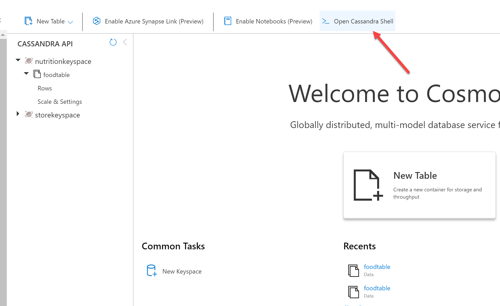
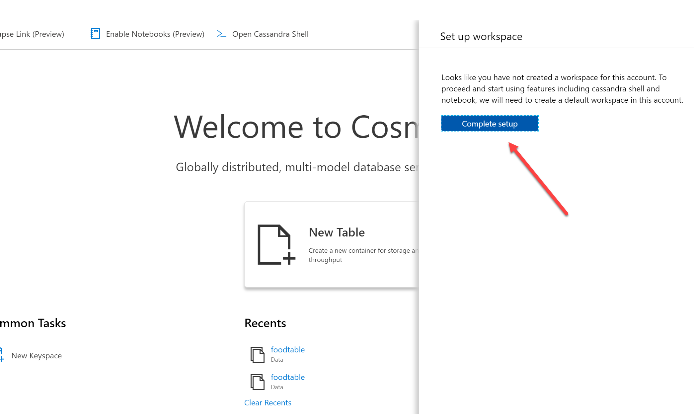
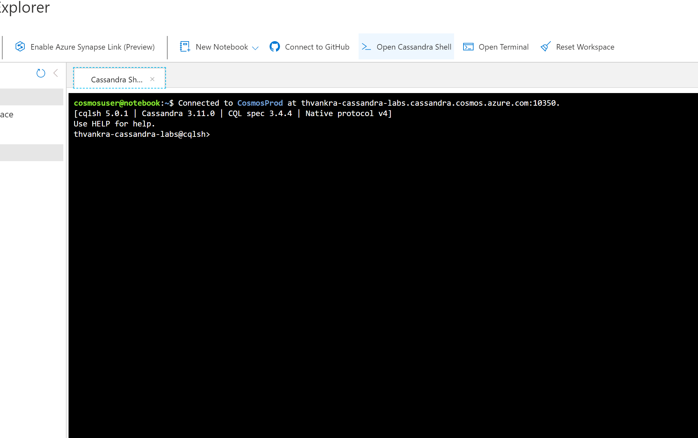
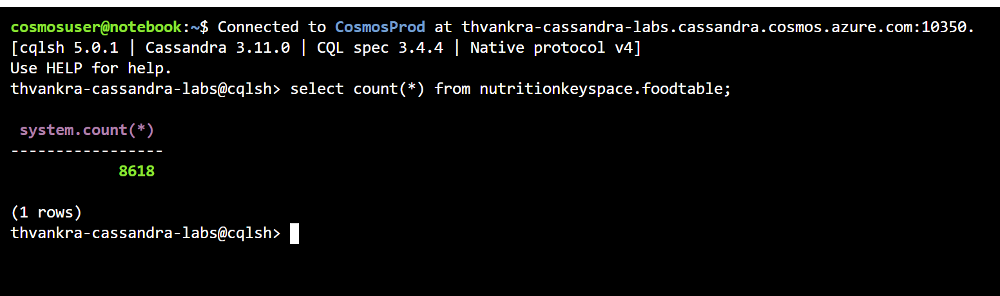

# Querying in Azure Cosmos DB Cassandra API with hosted CQLSH

Azure Cosmos DB Cassandra API accounts provide support for querying items using the Cassandra Query Language (CQL). In this lab, you will explore how to use these rich query capabilities directly through the Azure Portal. No separate tools or client side code are required.

If this is your first lab and you have not already completed the setup for the lab content see the instructions for [Account Setup](00-account_setup.md) before starting this lab.

> NOTE: A PRIMARY KEY consists of a the partition key followed by the clustering columns. You can only insert values smaller than 64 kB into a clustering column.

## Query Overview

Querying tables with CQL allows Azure Cosmos DB to combine the advantages of Cosmos DB with Cassandra targeted applications.

## Running your first query

In this lab section, you will query your **foodtable**.

### Set up hosted CQLSH

First, click on `Open Cassandra Shell`



When clicking on this, you will be prompted to complete setup:



Then, you can click on `Open Cassandra Shell` again to get the hosted shell. 



Lets try a count of the records you inserted in lab one:

```sql
select count(*) from from nutritionkeyspace.foodtable;
```

You should see a count of approx 8618 records:



### Exploring Indexing

TODO 

### Exploring Queries

TODO

```sql
CREATE INDEX ON nutritiondatabase.foodtable (foodgroup);

CREATE INDEX ON nutritiondatabase.foodtable (foodid);
```

13. Re-run the CQL query, you should now get back results

### Exploring Paging

TODO 

### Exploring Query Costs

1. TODO

### Exploring Read Consistency

- https://docs.microsoft.com/en-us/azure/cosmos-db/consistency-levels-across-apis#cassandra-mapping
  
1. TODO
   
## More Resources

- https://docs.microsoft.com/en-us/azure/cosmos-db/consistency-levels-across-apis#cassandra-mapping

## More Resources

- https://docs.datastax.com/en/dse/6.0/cql/cql/cqlAbout.html
- https://docs.datastax.com/en/cql-oss/3.3/cql/cql_using/useMultIndexes.html