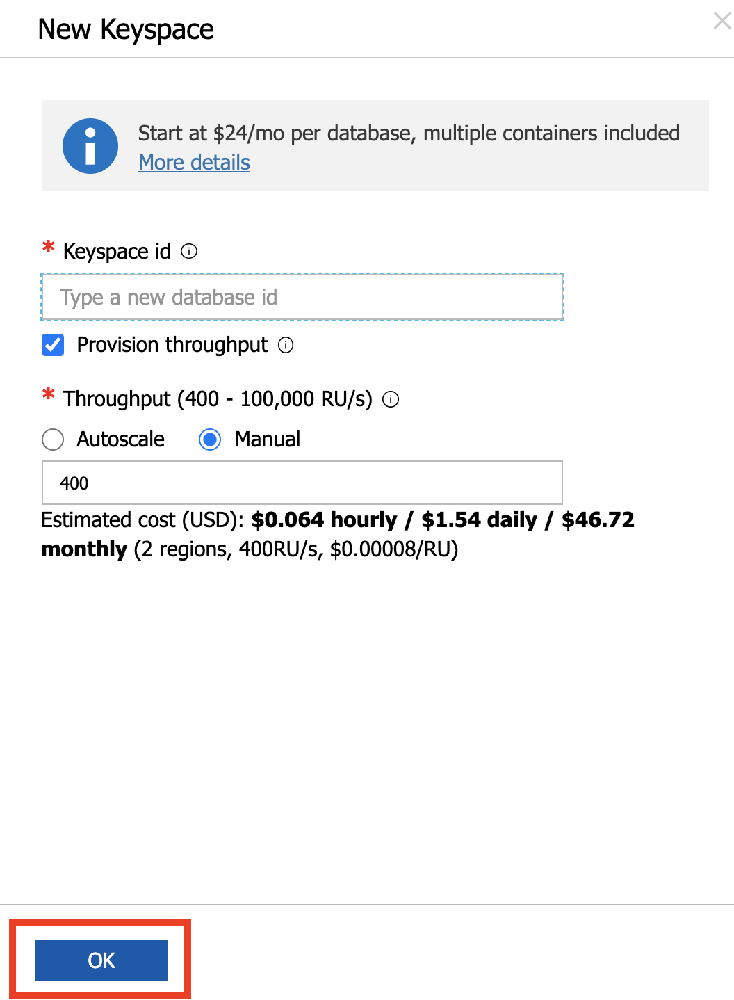

# Handling Rate limiting and multi-region failover in Azure Cosmos DB Cassandra API

Topics covered in this lab include:

- Rate Limiting errors and how to handle them in your application
- How to achieve failover with multi-region Load Balancing

> If this is your first lab and you have not already completed the setup for the lab content see the instructions for [Account Setup](00-account_setup.md) before starting this lab.

## Handling Rate Limiting errors

### Overview

Azure Cosmos DB is a resource governed system and same is the case with the Cassandra API for Cosmos DB. This means you can do a certain number of operations in a given second based on the [request units](https://docs.microsoft.com/azure/cosmos-db/request-units) consumed by the operations. If an application exceeds that limit, the [provisioned throughput](https://docs.microsoft.com/azure/cosmos-db/how-to-provision-container-throughput) will be exhausted leading to subsequent requests being rate-limited and exceptions being thrown. These are also called [429 errors](https://docs.microsoft.com/rest/api/cosmos-db/http-status-codes-for-cosmosdb) that are returned when clients consume more resources (RU/s) than the amount that what has been provisioned.

**What's the best way to tackle these?**

One of the ways you can resolve this is by increasing the RU/s and there is a [spectrum of options](https://docs.microsoft.com/en-us/azure/cosmos-db/manage-scale-cassandra#manage-scaling) for managing scale and provisioning throughput (RUs) in the Cassandra API.

But, you may want to handle these errors in the application itself. The good thing is that the Cassandra API in Azure Cosmos DB translates these exceptions (429 errors) to overloaded errors on the Cassandra native protocol and it is possible for the application to intercept and retry these requests. 

For Java, you can do this using the [Azure Cosmos DB extension](https://github.com/Azure/azure-cosmos-cassandra-extensions) for [Cassandra retry policy](https://docs.datastax.com/en/developer/java-driver/4.4/manual/core/retries/). 

> You can also use the [Spark extension](https://mvnrepository.com/artifact/com.microsoft.azure.cosmosdb/azure-cosmos-cassandra-spark-helper) to handle rate-limiting.


The sample application used to demonstrate the concepts is a REST API service built with the Spring Data Cassandra. It exposes a REST endpoint for clients to `POST` orders which are then persisted to Cassandra tables in Cosmos DB.

### Pre-requisites

1. Create keyspace called `ordersapp` in CosmosDB. In the Azure Portal, open your Cosmos DB account, select **Data Explorer**. From the **New Table** menu, choose **New Keyspace**


Enter `ordersapp` as the name and click **OK** to proceed.



2. Install [hey](https://github.com/rakyll/hey), a load testing program. You can download OS specific binaries from these links, but please Refer to https://github.com/rakyll/hey#installation for latest information:

- Linux 64-bit: https://storage.googleapis.com/hey-release/hey_linux_amd64
- Mac 64-bit: https://storage.googleapis.com/hey-release/hey_darwin_amd64
- Windows 64-bit: https://storage.googleapis.com/hey-release/hey_windows_amd64


### Configure and setup Orders API service

Clone the repository

```bash
git clone https://github.com/TheovanKraay/cassandra-workshops/
```

Update the `application.properties` located in `cassandra-wokrshops/labs/java/solutions/Lab03/orders-spring-data/src/main/resources` to include info for your Cosmos DB account.

```properties
spring.data.cassandra.keyspace-name=ordersapp
spring.data.cassandra.schema-action=CREATE_IF_NOT_EXISTS
spring.data.cassandra.ssl=true
spring.data.cassandra.contact-points=<cosmos account name>.cassandra.cosmos.azure.com
spring.data.cassandra.port=10350
spring.data.cassandra.username=<cosmos account name>
spring.data.cassandra.password=<cosmos access key>
#ssl_keystore_file_path=<path to keystore e.g. /Library/Java/JavaVirtualMachines/jdk1.8.0_221.jdk/Contents/Home/jre/lib/security/cacerts>
#ssl_keystore_password=<keystore password>
#cosmos_retry_read_dc=East US 2
#cosmos_retry_write_dc=East US
```

Note on optional fields:

- `ssl_keystore_file_path`: Enter the path to your keystore file. The default value is `<JAVA_HOME>/jre/lib/security/cacerts`
- `ssl_keystore_password`: Enter the keystore password. The default value is `changeit`
- `cosmos_retry_read_dc` - Cosmos DB region for read. Default value is `West US`
- `cosmos_retry_write_dc` - Cosmos DB region for write. Default value is `West US`

To start the application:

```shell
cd cassandra-workshops/labs/java/solutions/Lab03/orders-spring-data
mvn clean package
java -jar target/orders-spring-data-0.1.0-SNAPSHOT.jar
```

> The `orders` table will be automatically created when the service is started for the first time

To test the application, invoke the REST endpoint to create a few orders:

```shell
curl -X POST -H "Content-Type: application/json" -d '{"amount":"150", "location":"New York"}' http://localhost:8080/orders
```

Confirm that the order data was stored in Cassandra. Go to your Cosmos DB account, choose **Data Explorer**, select **ordersapp > orders > Rows**


You are all set to try out various scenarios

### Scenarios

**First attempt**

To start with, confirm the number of rows in the `orders` table. Open the **Cassandra Shell** in the Cosmos DB portal and execute the below query:

```shell
select count(*) from ordersapp.orders;

 system.count(*)
-----------------
    1

(1 rows)
```

> Your results might differ

In a different terminal, start load test:

```shell
hey -t 0 -m POST -H "Content-Type: application/json" -d '{"amount":"100", "location":"load_test_1"}' http://localhost:8080/orders
```

This will invoke the REST endpoint with 200 requests. This is enough to overload the system since we only have 400 RU/s provisioned as of now.

Notice the logs in the application terminal. In the beginning, you will see that the orders are being created successfully. For e.g.

```shell
Added order ID 25a8cec1-e67a-11ea-9c17-7f242c2eeac0
Added order ID 25a8f5ef-e67a-11ea-9c17-7f242c2eeac0
Added order ID 25a8f5ea-e67a-11ea-9c17-7f242c2eeac0
.....
```

After a while, when the RU/s (throughput) degrades and finally exceeds the provsioned limit, Cosmos DB will rate-limit the application requests. This will manifest itself in the form of an exception which will look similar to this:

```shell
WARN 50437 --- [r1-nio-worker-2] com.datastax.driver.core.RequestHandler  : Host foobar-cassandra.cassandra.cosmos.azure.com/104.45.144.73:10350 is overloaded.
```

You will see several of these exceptions followed by success messages which you saw earlier. What was the end result? The load test tried to create 200 orders. Let's check the final numbers. Open the **Cassandra Shell** in the Cosmos DB portal and execute the same query

```shell
select count(*) from ordersapp.orders;

 system.count(*)
-----------------
    201
```

You should see 200 **additional** rows (orders) have been inserted. This was made possible by the Retry Policy which we configured using the [Azure Cosmos DB extension](https://github.com/Azure/azure-cosmos-cassandra-extensions)

```java
...
//time in milliseconds
private static final int FIXED_BACK_OFF_TIME = 5000;
private static final int GROWING_BACK_OFF_TIME = 1000;
private static final int MAX_RETRY_COUNT = 20;

CosmosRetryPolicy retryPolicy = new CosmosRetryPolicy(MAX_RETRY_COUNT, FIXED_BACK_OFF_TIME, GROWING_BACK_OFF_TIME);
...
```

Switch back to the load testing terminal and check output statistics.

```shell
Summary:
  Total:        12.1823 secs
  Slowest:      10.3017 secs
  Fastest:      0.2374 secs
  Average:      3.0012 secs
  Requests/sec: 16.4172
  
  Total data:   10400 bytes
  Size/request: 52 bytes

Response time histogram:
  0.237 [1]     |■
  1.244 [77]    |■■■■■■■■■■■■■■■■■■■■■■■■■■■■■■■■■■■■■■■■
  2.250 [50]    |■■■■■■■■■■■■■■■■■■■■■■■■■■
  3.257 [22]    |■■■■■■■■■■■
  4.263 [0]     |
  5.270 [0]     |
  6.276 [0]     |
  7.282 [0]     |
  8.289 [22]    |■■■■■■■■■■■
  9.295 [0]     |
  10.302 [28]   |■■■■■■■■■■■■■■■


Latency distribution:
  10% in 0.2460 secs
  25% in 0.2569 secs
  50% in 1.3891 secs
  75% in 7.3559 secs
  90% in 10.2265 secs
  95% in 10.2399 secs
  99% in 10.2902 secs

Details (average, fastest, slowest):
  DNS+dialup:   0.0023 secs, 0.2374 secs, 10.3017 secs
  DNS-lookup:   0.0015 secs, 0.0000 secs, 0.0060 secs
  req write:    0.0001 secs, 0.0000 secs, 0.0022 secs
  resp wait:    2.9987 secs, 0.2373 secs, 10.3016 secs
  resp read:    0.0001 secs, 0.0000 secs, 0.0013 secs

Status code distribution:
  [200] 200 responses
```

The numbers will differ for your specific case depending upon multiple factors. But let's draw our attention to the following:

1. We clocked at `16.4172 Requests/sec` for `200` requests over a total execution time of `12.1823` secs
2. On an `Average` each request took `3.0012` secs
3. See the `Latency distribution` to take a look latency numbers
4. Another important metric is the `Status code distribution` - `[200] 200 responses`. This shows that at the end, our application responded with a HTTP 200 for all our requests (recall that we sent 200 requests

The takeaway is that all the 200 orders were successfully stored in Cosmos DB inspite of the rate-limiting errors, is because our application code transparently retried them based on the policy

**(Optional) Repeat the test with a lower number of requests**

You can repeat the same test with a lower number of requests (one which will not breach the provisioned throughput). For example:

```shell
hey -t 0 -n 60 -m POST -H "Content-Type: application/json" -d '{"amount":"100", "location":"load_test_1"}' http://localhost:8080/orders
```

> `-n 60` will send 60 requests

**(Optional) Increase provisioned  throughput**

You can increase the Request Units using the Azure Portal (for e.g. double it to `800` RU/s) and run the same load test


```shell
hey -t 0 -m POST -H "Content-Type: application/json" -d '{"amount":"100", "location":"load_test_1"}' http://localhost:8080/orders
```

You will not see the 429 errors now and relatively low numbers for latency, requests per second etc.

> Try increasing the no. of requests (using `-n` flag) to see when the throughput threshold is breached for the application to get rate limited

**Deactivate Retry Policy**

Update the code sample to comment out the part where the Retry Policy is configured. Modify `Utils.java` in `cassandra-workshops/labs/java/solutions/Lab03/orders-spring-data/src/main/java/com/microsoft/azure/samples/spring/` folder


Stop the app, re-build the app and restart it:

```shell
mvn clean package
java -jar target/orders-spring-data-0.1.0-SNAPSHOT.jar
```

Before running the load test again:

1. Note down the no. of rows in the orders table using `select count(*) from ordersapp.orders;`
2. If you had increased the provisioned throughput for the previous section, please ensure that you dial it back down to 400 RU/s


```shell
hey -t 0 -m POST -H "Content-Type: application/json" -d '{"amount":"100", "location":"load_test_2"}' http://localhost:8080/orders
```

In the application logs, you will notice errors:


```shell
....
WARN 27735 --- [r1-nio-worker-1] com.datastax.driver.core.RequestHandler  : Host foobar-cassandra.cassandra.cosmos.azure.com/104.45.144.73:10350 is overloaded.
ERROR 27735 --- [io-8080-exec-10] o.a.c.c.C.[.[.[/].[dispatcherServlet]    : Servlet.service() for servlet [dispatcherServlet] in context with path [] threw exception [Request processing failed; nested exception is org.springframework.data.cassandra.CassandraConnectionFailureException: SessionCallback; CQL [INSERT INTO orders (amount,id,location,time) VALUES ('100',ef306790-e3a4-11ea-ae52-8d4bf6bb6bc7,'load_test_2','2020-08-21T11:53:31.529Z');]; All host(s) tried for query failed (tried: foobar-cassandra.cassandra.cosmos.azure.com/104.45.144.73:10350 (com.datastax.driver.core.exceptions.OverloadedException: Queried host (foobar-cassandra.cassandra.cosmos.azure.com/104.45.144.73:10350) was overloaded: Request rate is large: ActivityID=6b0462b8-eb12-4e09-8aec-c052e2c1bd47, RetryAfterMs=500, Additional details='Response status code does not indicate success: TooManyRequests (429); Substatus: 3200; ActivityId: 6b0462b8-eb12-4e09-8aec-c052e2c1bd47; Reason: ({
  "Errors": [
    "Request rate is large. More Request Units may be needed, so no changes were made. Please retry this request later. Learn more: http://aka.ms/cosmosdb-error-429"
  ]
});)); nested exception is com.datastax.driver.core.exceptions.NoHostAvailableException: All host(s) tried for query failed (tried: foobar-cassandra.cassandra.cosmos.azure.com/104.45.144.73:10350 (com.datastax.driver.core.exceptions.OverloadedException: Queried host (foobar-cassandra.cassandra.cosmos.azure.com/104.45.144.73:10350) was overloaded: Request rate is large: ActivityID=6b0462b8-eb12-4e09-8aec-c052e2c1bd47, RetryAfterMs=500, Additional details='Response status code does not indicate success: TooManyRequests (429); Substatus: 3200; ActivityId: 6b0462b8-eb12-4e09-8aec-c052e2c1bd47; Reason: ({
  "Errors": [
    "Request rate is large. More Request Units may be needed, so no changes were made. Please retry this request later. Learn more: http://aka.ms/cosmosdb-error-429"
  ]
});))]
....
```

In the terminal where you ran the load test, at the end of the output summary, you will see that some the requests failed to complete successfully i.e. they returned a response other than HTTP 200

```shell
...
Status code distribution:
  [200] 140 responses
  [500] 60 responses
```
> Please note that these results are random and will differ in your case

In this case, the application got a non-`200` response for `60` requests. This means that `60` out of `200` orders were not stored in Cosmos DB table. You can easily confirm this by counting the no. rows (`select count(*) from ordersapp.orders;`) and comparing it with the previous count.

Because we had deactivated the Retry Policy, our application no longer retried the requests that failed due to rate-limited errors. The exceptions received from the Cassandra driver were intercepted and re-throw by the Azure Cosmos DB extensions library.

### How does retry work behind the scenes?

In-depth explanation of is out of scope of this lab. Please consult the [source code for the Azure Cosmos DB extension for Cassandra Retry Policy](https://github.com/Azure/azure-cosmos-cassandra-extensions/blob/master/package/src/main/java/com/microsoft/azure/cosmos/cassandra/CosmosRetryPolicy.java) if you want to understand how it is implemented.

In a nutshell, the retry policy handles errors such as `OverLoadedError` (which may occur due to rate limiting), and parses the exception message to use `RetryAfterMs` field provided from the server as the back-off duration for retries. If `RetryAfterMs` is not available, it defaults to an exponential growing back-off scheme. In this case the time between retries is increased by a growing back off time (default: 1000 ms) on each retry, unless `maxRetryCount` is -1, in which case it backs off with a fixed duration. It is important to handle rate limiting in Azure Cosmos DB to prevent errors when provisioned throughput has been exhausted.

## Failover with Load Balancing

TODO

## Conclusion

> If this is your final lab, follow the steps in [Removing Lab Assets](07-cleaning_up.md) to remove all lab resources.


## Additional Resources

- https://github.com/Azure-Samples/azure-cosmos-cassandra-java-retry-sample
- https://docs.microsoft.com/en-us/azure/cosmos-db/cassandra-support#usage-of-cassandra-retry-connection-policy
- https://docs.microsoft.com/en-us/azure/cosmos-db/manage-scale-cassandra
- https://github.com/Azure-Samples/azure-cosmos-cassandra-java-retry-sample
